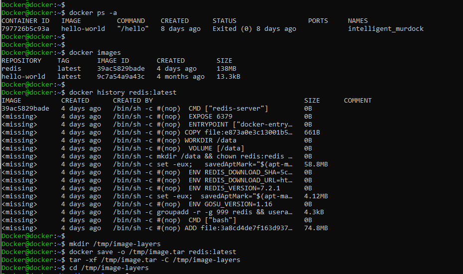
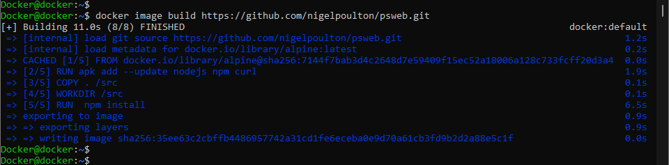

> #### The is a sample dockerfile that walks through implementing | deploying apps using stackfile or images from DTR!
>
> - The steps are going to be as descriptive as possible.  
> - I will also include images to make it more interactive some of these images would include sensitive details | you probably should not share a few of these details if you plan on keeping the VM | instances after the reproduction. 

> The first step is to install the docker CE you can do so by following the [docker install link](https://docs.docker.com/desktop/install/ubuntu)  

 


> This is optional but you can create a user to work out of that way you don't need to repeat sudo commands

```
sudo groupadd docker
sudo useradd dennis
sudo passwd dennis
```
> 


> Use this cmdlet to pull the Redis image from the docker hub (if you do not specify a registry docker, docker will pull from docker hub)

```
docker image pull redis  
docker image ls
docker image ls --digests
docker system info
```


> You can check the layers for docker images

`sudo ls -al /var/lib/docker/overlay2`		


``` 
docker ps -a 	                        - used to list all the running containers
docker images	                        - used to list all the images
docker image inspect redis:latest	- used to inspect the images
```




> - building a Dockerfile from the alpine image to deploy app.js
> - *Dockerfile*

 ```
From alpine
 
LABEL maintainer="dennis@ceyden.com"
 
RUN apk add --update nodejs npm
 
COPY . /src
 
WORKDIR /src
 
RUN npm install
 
EXPOSE 8080
 
ENTRYPOINT ["node", "./app.js"]
```


> - *app.js*

```
 
const http = require('http');
 
const hostname = '0.0.0.0';
const port = 8080;
 
const server = http.createServer((req, res) => {
  res.statusCode = 200;
  res.setHeader('Content-Type', 'text/plain');
  res.end('Hello ladies and gentlemen, welcome to our new site. This site was built by a container running on Docker!\n');
});
 
server.listen(port, hostname, () => {
  console.log(`Server running at http://${hostname}:${port}/`);
});
```


> - *package.json*

``` 
{
  "name": "ceyden-app",
  "version": "1.0.0",
  "description": "sample docker app",
  "main": "app.js",
  "dependencies": {
    "express": "^4.17.1"
  },
  "scripts": {
    "start": "node app.js"
  },
  "author": "Dennis",
  "license": "MIT"
}
```


```
sudo nano Dockerfile				                - create Dockerfile
sudo nano package.json				                - create package.json file
docker image build -t ceydenApp .		                - build image from Dockerfile
sudo nano app.js				                - create app.js file
docker container run -d --name ceyden -p 8080:8080 ceydenapp	- create a container
```


```
docker image build https://github.com/nigelpoulton/psweb.git	- build docker image from git 
docker container run -d --name ceyden -p 8080:8080 35ee63c2cbff	- build container from image tag
```




```
git clone https://github.com/uncledenniss/atsea-sample-shop-app.git -   cloning an app from a git repo 
cd atsea-sample-shop-app.git                                        -   changing into the app dir
docker image build -t multistage .                                  -   attempting a multistage build from within the app
```


> I could not build the image because I did not have the java dev kit, I installed that and was able to complete the multi-stage build


```
docker container run -it alpine sh
docker container ls 
docker container exec -it 402e0602c8aa
echo "cool text for file"
ls
docker container run -d alpine sleep id
docker container ls -al
docker container start 402
```


```
docker container rm $(docker container ls -aq) -f
docker container run -d --name webapp1 -p 80:80 nginx:latest
docker port webapp1
docker system info
docker swarm init
docker swarm join-token manager
docker swarm join-token worker
docker node ls
docker swarm join-token --rotate worker
sudo openssl x509 -in /var/lib/docker/swarm/certificates/swarm-node.crt -text
docker swarm update --autolock=true
service docker restart
docker swarm unlock
docker swarm update --cert-expiry 72h
```


```
docker network ls
docker network inspect bridge
docker port webapp1
docker network create -d bridge third-mainland
docker container run --rm -d --network third-mainland nginx
docker network create -d overlay newSpectranet
docker service create -d --name telepath --replicas 2 --network newSpectranet alpine
docker service ls
```


```
docker volume ls
docker volume create myVol
docker volume inspect myVol
sudo ls -l /var/lib/docker/volumes
docker container run -dit --name volTest --mount source=ubervol,target=/vol alpine:latest
docker container exec -it volTest sh
echo "newBalance" > /vol/newfile
cat /vol/newfile
exit
sudo cat /var/lib/docker/volumes/ubervol/_data/newfile
docker container rm volTest -f
docker volume ls
```


```
echo "passkey123" > secret.txt
cat secret.txt
docker secret create secret.txt
docker secret ls
docker secret inspect newsec
docker service create -d --name secret-service \
--secret newsec nginx:latest
docker service inspect secret-service
docker container ls
docker container exec -it d6ff nginx
curl -o stackfile.yml \
https://raw.githubusercontent.com/dockersamples/example-voting-app/main/docker-stack.yml
cat stackfile.yml
```


```
docker stack deploy -c stackfile.yml inec
docker stack ls
docker stack ps inec
sudo lsof -i :5000
docker stack services inec
docker service scale inec_vote=20
docker ps --format "table {{.ID}}\t{{.Names}}\t{{.Ports}}"
```


```
docker diff {CONTAINER_ID_OR_NAME}		- used to access the diff files 
docker history redis:latest			- used to check image 
mkdir /tmp/image-layers				- used to create tmp dir
docker save -o /tmp/image.tar redis:latest	- used to create a tarball of image
tar -xf /tmp/image.tar -C /tmp/image-layers	- extract content of tarball and cp to image-layer
cd /tmp/image-layers				- change directory to image-layer
ls -al						- list diff content
docker stop <container_id>			- stop container
docker rm <container_id>			- remove container 
docker image rm redis				- delete image
```


 

 

 

 
 
 

